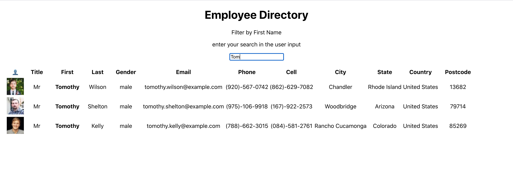

# Employee_Directory

This is a simple one page application where a user can filter a list of employees by first name. This app is built using React as the front end library.

:link: [Employee Directory](https://empdirtkj.herokuapp.com/)


#### Built With: 
- HTML, CSS, JavaScript and jQuery for the front end
- Node.js
- React
- [randomuser.me](randomuser.me) API


#### Appication Overview:
__Online App__


- Each typed input in the name search field will update the list of employees dynamically
- Employees are randomly generated via [randomuser.me](randomuser.me) API - meet new people by refreshing the page!


## Deployment

#### Locally

To install and use locally,

1. `git clone` the repository to a local directory
2. In the terminal, `cd` to the repository directory and run

```bash
npm i
```

3. Then start the application with:

```bash
npm start
```

4. You can then navigate to [http://localhost:3000/](http://localhost:3000/) in your browser of choice

#### Online
All that being said, you can find the deployed application on Heroku. Navigate to the :link: [Employee Directory](https://empdirtkj.herokuapp.com/) online and save yourself some time and effort!


## Future Development
* Beautification of the app -- Specifically a better table with proper headings and lines
* Multiple Ordering options
* Filter by State -- All of the example Employees are based in the US, so a State filter would be a handy Use Case